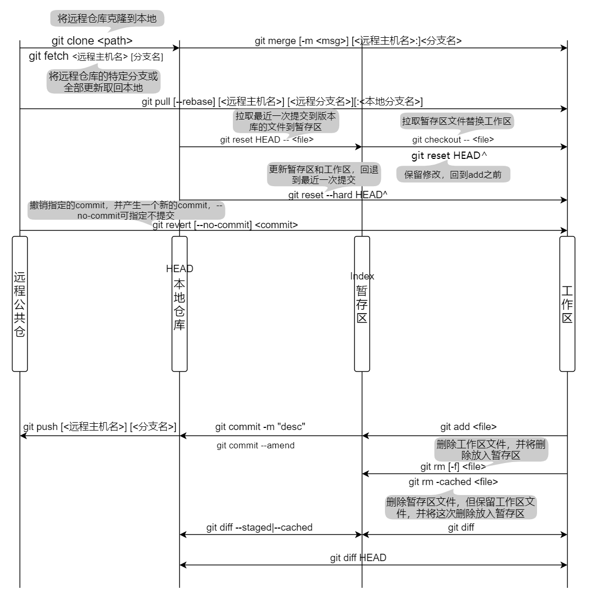

## Git常用命令
- 基本操作

- 分支操作  
`git branch [-r|-a]` 查看本地/远程/全部分支  
`git branch <name>` 创建分支  
`git checkout <name>` 切换到分支  
`git checkout -b <name>` 创建并切换到分支  
`git checkout -b <name> <origin>/<name>` 使用远程仓库的某个分支创建本地分支并切换  
`git checkout --merge <name>` 切换到分支，并将当前分支修改同步到切换的分支下  
`git branch -D|--delete <name>` 删除分支
- 文件操作  
`git checkout -- <file>` 撤销文件在工作区的全部修改，若文件已被添加到暂存区，则回到添加到暂存区后的状态，否则回到和版本库一致的状态  
`git reset HEAD <file>` 拉取最近一次提交到版本库的文件到暂存区，该操作不影响工作区
- 其它命令  
`git status` 显示文件或文件夹在工作区、暂存区的状态  
`git diff <SHA1> <SHA2>` 比较两个历史版本之间的差异  
`git push origin HEAD --force` 强制提交，之前错误的提交就从远程仓库删除  
`git tag [-l -n]` 查看标签，-l列表形式列出，-n附加说明  
`git tag -l 1.*.*` 查复符合检索条件的标签  
`git tag <name>` 创建tag(本地)  
`git tag -a 1.0.0 -m "desc"` 创建带备注的tag  
`git tag -a 1.0.0 <commit_id> -m "desc"` 针对特定的commit版本SHA创建标签  
`git tag -d 1.0.0` 删除标签(本地)  
`git push origin --tags` 将本地所有标签发布到远程仓库  
`git push origin --delete <name>` 删除远程仓库对应标签  
`git remote -v` 查看关联远程库  
`git remote add <name> <url>` 关联远程库  
`git cherrypick <SHA1> [<SHA2>...]` 将指定的一个或多个提交应用于当前分支，产生一个新的提交  
`git cherrypick <SHA1>..<SHA2>` 将sha1(不包含)至sha2的所有提交应用于当前分支  
`git cherrypick <SHA1>^..<SHA2>` 将sha1(包含)至sha2的所有提交应用于当前分支
    
<待补充...>

## 常见的Git协作流程
### 一.Git Flow工作流
&emsp;&emsp;Git Flow定义了一个项目发布的分支模型，为管理具有预定发布周期的大型项目提供了一个健壮的框架。其优点是各分支分工明确，清晰可控，使
多人项目协作开发更加规范；缺点是相对复杂，需要同时维护两个长期分支。

1. master分支  
存放所有正式发布的版本，可作为项目历史版本记录分支，不直接提交代码。
2. hotfix分支  
基于master创建，对线上版本的bug进行修复，完成后直接合并到master分支和develop分支，如果当前还有新功能release分支，也需要同步到release分支上。
同一时间只有一个，生命周期较短。
3. release分支  
基于develop分支创建，当新功能足够发布一个新版本（或接近新版本的发布日期），从develop分支创建一个release分支作为新版本的起点，用于测试，所有的
测试bug在这个分支修改。测试完成后合并到master并打上版本号，同时也合并到develop分支。一旦release分支创建后，就不能从develop分支合并新的改动
到release分支。同一时间只有一个，生命周期较短，仅用于发布。
4. develop分支  
主开发分支，整合各个功能feature分支。
5. feature分支  
基于develop分支创建，新功能分支，开发完成后合并入develop分支，同一时间存在多个。

### 二.Github Flow工作流
&emsp;&emsp;如[官网](https://guides.github.com/introduction/flow)所描述，GitHub flow是一个轻量级的，基于分支的工作流，它支持定期
进行部署的团队和项目。  

其主要步骤如图所示。当开发新特性时，直接从master拉取分支，内容开发完成后，提交PR并用当前分支发布做验证，如果确定不需要新增或者修改，
就可以将内容合并到master上，此时master上就会随时包含最新的内容，随时都可以进行发布操作。
可以看出该工作流的优点是操作简单，适合持续发布的工作流程；缺点是master是实时更新的，不适用于版本发布的工作流程。

### 三.Gitlab Flow工作流
&emsp;&emsp;Gitlab Flow遵循"上游优先"的原则，即只存在一个主分支master，它是所有其它分支的"上游"，只有上游分支采纳的代码变化，才能应用到其它分支。
- 持续发布使用场景  
&emsp;&emsp;除长期分支master外，再分别创建一个预发布分支pre-production和一个发布分支production，production分支以pre-production为上游，
代码修改提交到master后，先合并到pre-production分支来验证内容是否具有风险和bug，如果没有问题，则直接合并到production分支上进行发布。
- 版本发布使用场景  
&emsp;&emsp;每一个稳定的版本都单独作为一个分支存在，从master上拉取出来，以后只有master上的bug修复才会被cherry-pick到这些单独的版本分支上，
而对于master上的新内容是不采取合并操作的。例如创建了稳定版本stable1分支后，master可以继续接受来自其它分支的合并内容，但这些内容和stable1分支没有关系，
因为stable1分支是某个具体的版本，只包含固定的内容。只有那些发现了存在于stable1上的Bug，才会需要从master合并到stable1上。

### 四.其它类型工作流
&emsp;&emsp;这里主要是为了记录我当前使用的工作流，是基于Github Flow的一个变种，因为Github工作不适合做版本发布，因此做了适当改进。
在实际的工作中，不能囿于以上的工作流程，要根据实际的工作环境和开发场景选择最适合自身项目的工作流程。
以当前的Github的基于Fork&Pull模型为例，首先fork项目主仓库(upstream)到自己的托管空间(origin)下，从origin创建分支，进行修改提交；
特性开发完成后从upstream创建PR，之后进行代码评审及静态检查等，代码评审过程中所做的修改任然可以提交到该分支上；
之后可以部署此分支的代码到生产环境，若功能验证无错误，则可进行merge，此处直接合并到master可能存在风险，一般的操作是在upstream创建一个develop分支，
所有的PR都提交到该分支上，在该分支上进行功能的测试，测试无误后创建tag并将develop分支代码merge入master。
对于已经实现类似于github的Actions的自动化构建功能的系统来说，先PR到develop分支是值得推荐的，因为自动化构建发布通常只能从主仓库选取分支。
